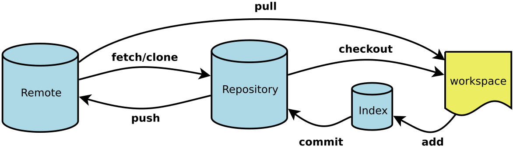

# Git Cheatsheet

## Useful Commands

### Command Name

`INSERT CLI COMMAND HERE`

### Develop the Exiting project:

- `Git clone <url>` / `Git pull` - update to the newest vision
- `Git add <file>`
- `Git status` –(check status)
- `Git commit –m `meaningful message`
- `Git push`

### New project

- `Mkdir newproject` - create new folder
- `Cd newproject`
- `Git init`

`Git log` –(check the commit history)

`Git diff` – (check differents)

### Branch

- `Git checkout -b xxx` – (create new branch)
- `git checkout xxx` - (change to xxx branch)

### If you don't have a new branch yet

- `git pull`
- `git checkout -b newbranch`

### If you have a branch already

- `git checkout main` (switch back to main repo)
- `git pull` (pull updates from git)
- `git checkout newbranch` (switch back to own branch)
- `git pull origin main` (pull updates from main to own branch)

Why do we use it:

- type reason here

How do we use it:

- type how we use it here

When do we use it:

- type how when do we use it here

Reference to the command line documentation
